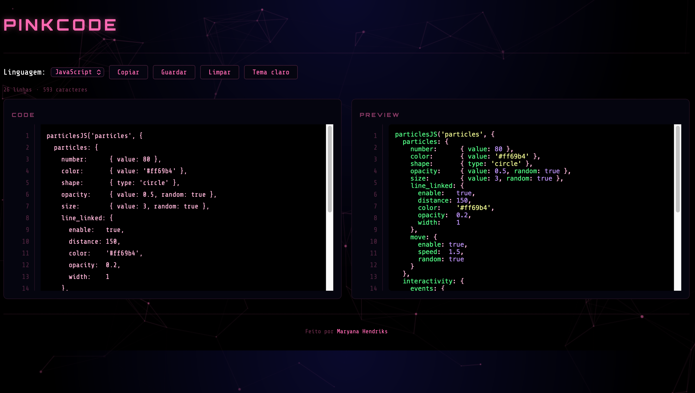
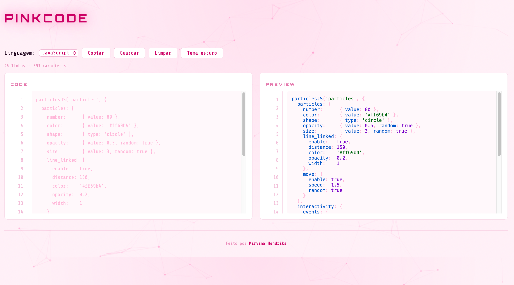

##  🇧🇷 Português:

# 🌸 PinkCode — Visualizador de Código

---

## Sobre o projeto

O **PinkCode** é um visualizador de código com destaque de sintaxe (syntax highlighting) desenvolvido do zero com HTML, CSS e JavaScript puro. Este projeto foi criado com foco em aprendizado, explorando conceitos fundamentais do desenvolvimento web front-end sem o uso de frameworks.

A ideia foi construir uma ferramenta funcional e visualmente atraente, com tema espacial e identidade própria em tons de rosa — do zero, linha por linha.

---

## ✨ Funcionalidades

- **Syntax highlighting em tempo real** — o código é destacado automaticamente enquanto você escreve
- **5 linguagens suportadas** — JavaScript, Python, C#, Java e C++
- **Dois temas** — tema escuro (espacial preto) e tema claro (espacial branco), alternados com um clique
- **Números de linha** — exibidos tanto no editor quanto no painel de preview
- **Contador de linhas e caracteres** — atualizado em tempo real
- **Copiar código** — copia o conteúdo do editor para a área de transferência com feedback visual
- **Guardar código** — salva o código no `localStorage` do navegador, mantendo o conteúdo mesmo após fechar a página
- **Limpar editor** — apaga todo o conteúdo com um clique
- **Fundo animado** — partículas interativas em rosa que reagem ao movimento do mouse

---

## 🛠️ Tecnologias utilizadas

| Tecnologia | Uso |
|---|---|
| HTML5 | Estrutura semântica da página |
| CSS3 | Estilização, Grid, Flexbox, animações e temas |
| JavaScript ES6+ | Lógica da aplicação, eventos e DOM |
| [highlight.js](https://highlightjs.org/) v11.9 | Biblioteca de syntax highlighting |
| [particles.js](https://vincentgarreau.com/particles.js/) | Fundo animado com partículas |
| Google Fonts | Fontes Orbitron e Share Tech Mono |

---

## 📚 O que aprendi com esse projeto

- Como carregar e usar bibliotecas externas via CDN
- Manipulação do DOM com JavaScript puro
- Uso de eventos: `input`, `change`, `click`, `keydown`
- CSS Grid e Flexbox para layout responsivo
- CSS Custom Properties (variáveis) para temas
- Animações com `@keyframes`
- Clipboard API para copiar texto
- localStorage para persistir dados no navegador
- Organização de código em ficheiros separados

---

## 🇺🇸 English:

# 🌸 PinkCode — Code Viewer

## About the project

**PinkCode** is a code viewer with syntax highlighting built from scratch using HTML, CSS and vanilla JavaScript. This project was created with a focus on learning, exploring fundamental concepts of front-end web development without the use of frameworks.

The idea was to build a functional and visually appealing tool, with a space theme and its own identity in shades of pink — from scratch, line by line.

---

## ✨ Features

- **Real-time syntax highlighting** — code is highlighted automatically as you type
- **5 supported languages** — JavaScript, Python, C#, Java and C++
- **Two themes** — dark theme (black space) and light theme (white space), toggled with one click
- **Line numbers** — displayed in both the editor and the preview panel
- **Line and character counter** — updated in real time
- **Copy code** — copies the editor content to the clipboard with visual feedback
- **Save code** — saves the code to the browser's `localStorage`, keeping the content even after closing the page
- **Clear editor** — erases all content with one click
- **Animated background** — interactive pink particles that react to mouse movement

---

## 🛠️ Technologies used

| Technology | Usage |
|---|---|
| HTML5 | Semantic page structure |
| CSS3 | Styling, Grid, Flexbox, animations and themes |
| JavaScript ES6+ | Application logic, events and DOM |
| [highlight.js](https://highlightjs.org/) v11.9 | Syntax highlighting library |
| [particles.js](https://vincentgarreau.com/particles.js/) | Animated particle background |
| Google Fonts | Orbitron and Share Tech Mono fonts |

---
## 📚 What I learned with this project

- How to load and use external libraries via CDN
- DOM manipulation with vanilla JavaScript
- Using events: `input`, `change`, `click`, `keydown`
- CSS Grid and Flexbox for responsive layout
- CSS Custom Properties (variables) for themes
- Animations with `@keyframes`
- Clipboard API for copying text
- localStorage for persisting data in the browser
- Organizing code into separate files

---

  Made with 🌸 by Maryana Hendriks

